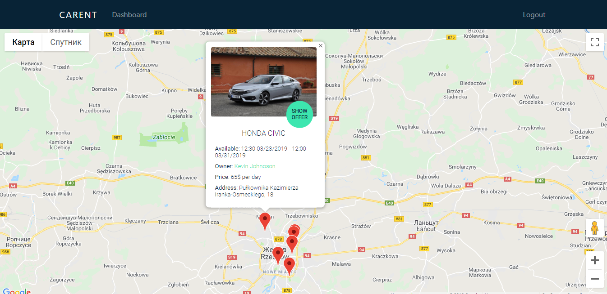
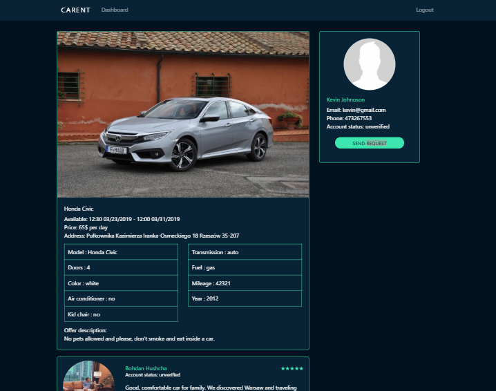
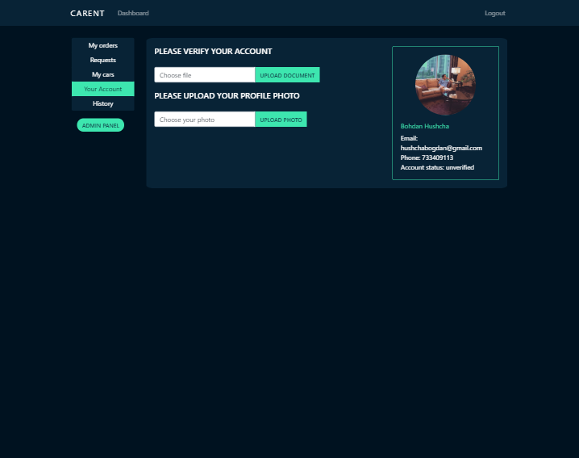
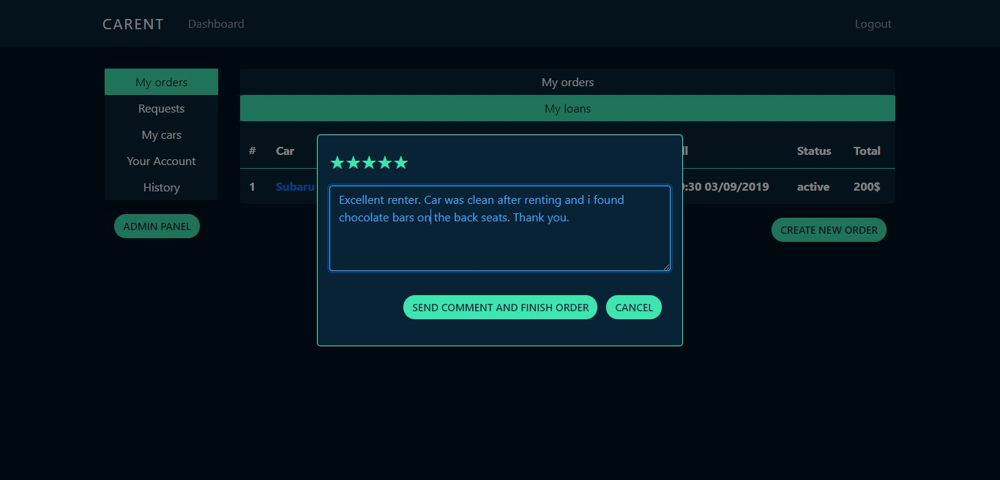
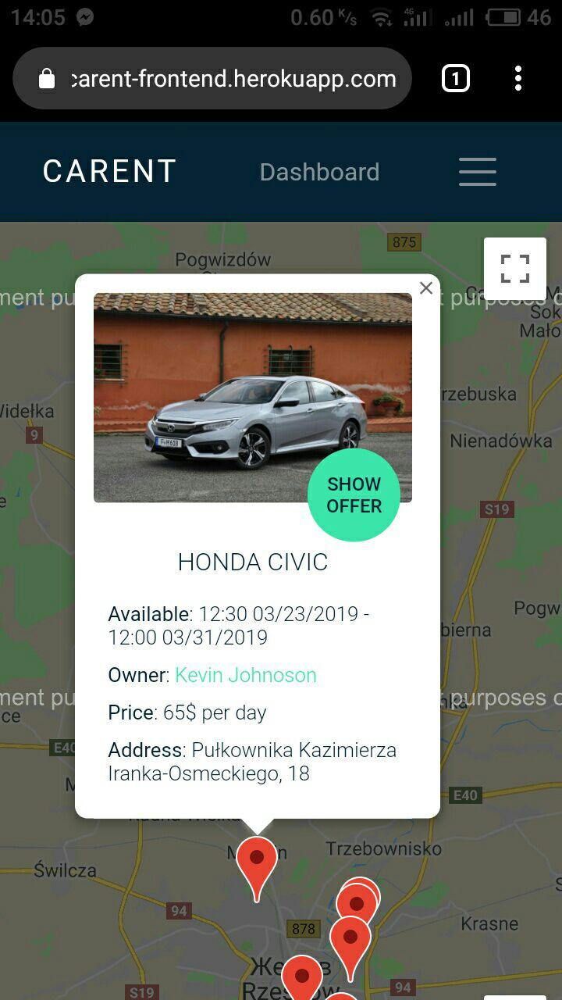
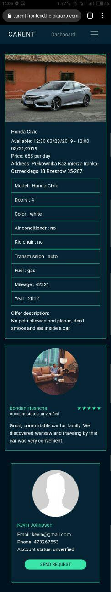
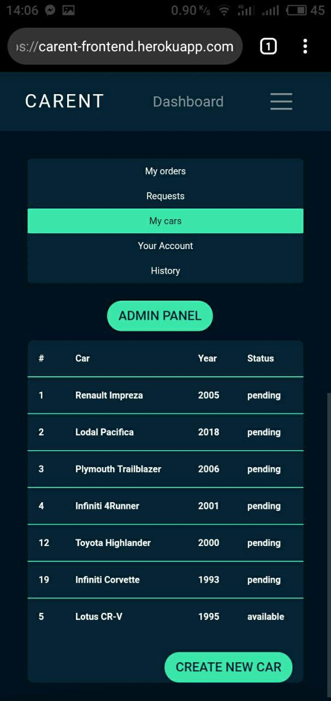
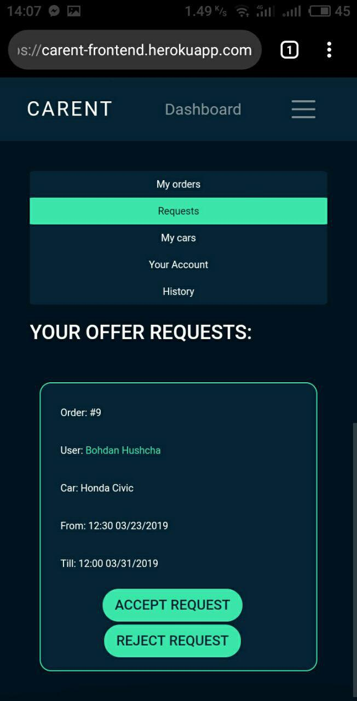
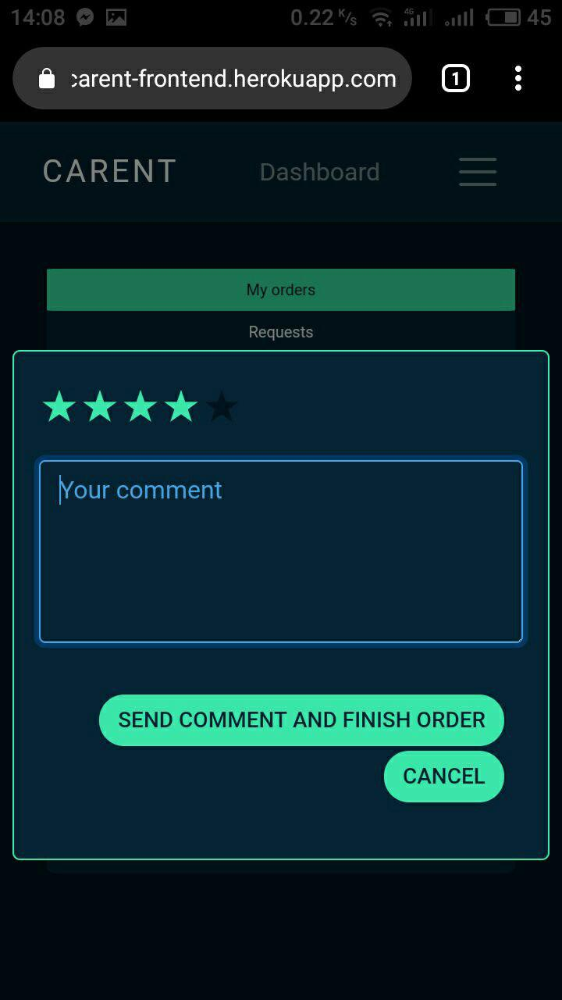

Share your car and earn your stable passive income or just find a vehicle around and forget about public transportation.

Some screenshots of an application:

1. Desktop version

* Main screen

    

* Car offer

    

* Dashboard

    

* Feedback

  

2. Mobile views:

* Main screen

   

* Car offer

   

* Dashboard

   

* Requests

   

* Feedback

   

